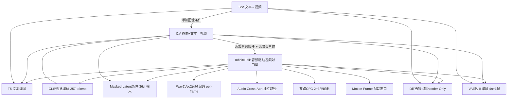

# T2V / I2V / InfiniteTalk 技术原理深度解析

> 基于 [InfiniteTalk 代码库](file:///d:/vibecoding/InfiniteTalk) 的源码级别分析

---

## 一、T2V（Text-to-Video）—— 文本生成视频

### 1.1 核心思想

T2V 的目标是将一段自然语言描述（prompt）转化为连贯的视频序列。其核心技术路线是 **扩散模型（Diffusion Model）** + **Latent Space（潜空间）**，整体采用 **DiT（Diffusion Transformer）** 架构。

### 1.2 技术架构

```
文本 Prompt
    ↓
 T5 文本编码器（Text Encoder）
    ↓
 文本语义向量 context [B, 512, 4096] → text_embedding MLP → [B, 512, 2048]
    ↓
[纯噪声 z_T] → DiT（WanModel）→ [去噪迭代 T次] → 潜空间表示 z_0
    ↓
 VAE Decoder（解码器）
    ↓
 视频帧序列（C × N × H × W）
```

### 1.3 三大核心组件

#### ① T5 文本编码器
- 将文本 prompt 转换为高维语义嵌入向量 `context`（维度 4096）
- 同时编码 negative prompt（负提示词）生成 `context_null`，用于 CFG 引导
- 在代码中对应 [`T5EncoderModel`](file:///d:/vibecoding/InfiniteTalk/wan/modules/t5.py)

```python
# text2video.py 核心代码
context = self.text_encoder([input_prompt], self.device)       # 正向语义
context_null = self.text_encoder([n_prompt], self.device)     # 负向语义（CFG用）
```

#### ② VAE（变分自编码器）

使用 **因果卷积 CausalConv3d**，时空压缩比为 `vae_stride = (4, 8, 8)`（时间4倍，空间8倍）。

**编码逻辑**（[vae.py L520-534](file:///d:/vibecoding/InfiniteTalk/wan/modules/vae.py)）：

```python
# 按 1、4、4、4... 的分组对视频帧编码
iter_ = 1 + (t - 1) // 4   # 81帧 → 21次迭代
for i in range(iter_):
    if i == 0:
        out = encoder(x[:, :, :1, ...])         # 第0帧单独编码 → latent 帧0
    else:
        out_ = encoder(x[:, :, 1+4*(i-1):1+4*i, ...])  # 每4帧 → 1个latent帧
        out = torch.cat([out, out_], dim=2)
```

**帧数约束**：必须满足 `F = 4n+1`（如 81 = 4×20+1），否则无法整除。

| 视频帧数 F | latent 帧数 | 说明 |
|-----------|-----------|------|
| 1 | 1 | 静态图像 |
| 5 | 2 | 4×1+1 |
| 81 | 21 | 4×20+1（默认） |

#### ③ DiT（Diffusion Transformer）—— 纯 Encoder-Only 结构

> [!IMPORTANT]
> DiT 没有 Decoder，是纯堆叠的 Encoder Block，通过对整个序列联合去噪（非自回归），输入输出形状完全相同。

**每个 WanAttentionBlock 结构**（[model.py L238-317](file:///d:/vibecoding/InfiniteTalk/wan/modules/model.py)）：

```
视频 latent x [B, L, dim]
      ↓
Self-Attention（帧间/帧内建模）← 时间步 t 通过 AdaLN 调制（scale/shift）
      ↓
Cross-Attention（文本/图像语义注入）
  Q = 视频 token，K/V = context（文本+CLIP）
      ↓
FFN ← 时间步 t 通过 AdaLN 调制
      ↓
输出仍是 [B, L, dim]
```

**条件注入的两条并行路径**：

| 条件 | 注入方式 | 技术细节 |
|------|---------|---------|
| 文本 / CLIP 图像 | Cross-Attention（KV来自context）| 内容级引导，告诉模型"生成什么" |
| 时间步 t | AdaLN（scale+shift LayerNorm输出）| 过程级引导，告诉模型"当前噪声水平" |

**3D RoPE 位置编码**：对时间 F、高度 H、宽度 W 三个轴分别分配 RoPE 频率，合并后注入 Self-Attention 的 Q/K，使模型天然感知时空位置。

### 1.4 扩散过程（Flow Matching）

> Wan 系列使用的是 **Flow Matching** 而非传统 DDPM，本质上是在连续时间流中学习数据分布

**训练时**：
- 将真实视频编码到潜空间 $z_0$
- 用随机噪声 $z_T \sim \mathcal{N}(0, I)$ 和时间步 $t$ 对其加噪
- DiT 学习预测从 $z_T$ 到 $z_0$ 的速度场（velocity field）

**推理时（Euler ODE 积分）**：
```
z_T（纯高斯噪声）
    ↓ dt = (t_i - t_{i+1}) / T
    latent += velocity_pred × dt
    ↓ ...40步迭代...
z_0（干净潜变量）
    ↓ VAE Decode
视频帧
```

### 1.5 分类器自由引导（CFG）

```python
# text2video.py
noise_pred = noise_pred_uncond + guide_scale * (noise_pred_cond - noise_pred_uncond)
```

每个去噪步需要 **2次前向**（有条件 + 无条件）。

---

## 二、I2V（Image-to-Video）—— 图像生成视频

### 2.1 核心思想

I2V 在 T2V 的基础上增加了一个关键约束：**第一帧必须与给定图像一致**。模型需要学会从静止图像"想象"出合理的动态变化。

### 2.2 相比 T2V 的核心差异

I2V 引入了 **两个额外的视觉条件编码器**：

```
文本 Prompt          参考图像 img
    ↓                    ↙         ↘
 T5 编码器        CLIP 视觉编码器   VAE 编码器
    ↓                  ↓               ↓
 context          clip_context     y（带mask的图像latent）
    ↓                  ↓               ↓
              WanModel（DiT）
                    ↓
              去噪后的 latent
                    ↓
              VAE Decode → 视频
```

### 2.3 图像条件注入方式

#### ① CLIP 视觉编码器（全局语义）

```python
# image2video.py L236
# img: [3, H, W] → img[:, None, :, :]: [3, 1, H, W]（添加T维）
clip_context = self.clip.visual([img[:, None, :, :]])
```

- 内部 `visual()` 将 `[C,T,H,W]` transpose 为 `[T,C,H,W]`，T帧展开成 Batch 送入标准 ViT
- 输出投影为 `[B, 257, dim]` 后**拼到 context 前面**：`context = [CLIP(257) | T5(512)]`
- 通过 `WanI2VCrossAttention` 中的双路 K/V 机制注入（图像用专用 `k_img/v_img`，文本用标准 `k/v`）

#### ② VAE 编码 + Mask（像素级锚定）

这是 I2V 最关键的机制 —— **Masked Latent Conditioning**：

**Mask 构建过程**（[image2video.py L210-217](file:///d:/vibecoding/InfiniteTalk/wan/image2video.py)）：

```python
# 步骤1：建立视频帧级 mask（81帧）
msk = torch.ones(1, 81, lat_h, lat_w)
msk[:, 1:] = 0   # 只有第0帧=1

# 步骤2：第0帧复制4份（对齐VAE时间分组 1+4+4+...）
msk = concat([repeat(msk[:,0:1], 4), msk[:,1:]])
# → [1, 84, lat_h, lat_w]

# 步骤3：折叠为 latent 时间分组格式
msk = msk.view(1, 21, 4, lat_h, lat_w).transpose(1,2)[0]
# → [4, 21, lat_h, lat_w]
```

> [!NOTE]
> 81是视频帧数（中间状态），最终 mask 是 **[4, 21, lat_h, lat_w]**（latent时间维）。
> 4通道的原因是凑出整齐的 patch_embedding 输入维度：`16(noise) + 4(mask) + 16(image_latent) = 36`。

**条件拼接**：
```
noise latent:  [16, 21, H, W]  ← 待去噪
─────────────────────────────
mask:          [ 4, 21, H, W]  ← 1=已知帧，0=待生成
image latent:  [16, 21, H, W]  ← VAE编码（t=0为真实图像，t=1~20为零）
─────────────────────────────
DiT 输入:      [36, 21, H, W]  ← 通道维拼接后送 patch_embedding
```

这本质上是把 **I2V 当成一个 Latent Inpainting 问题**：
- mask=1 区域：VAE latent 有真实内容 → 模型学到"保持不变"
- mask=0 区域：VAE latent≈0（零图像编码）→ 模型"自由生成且与第0帧连贯"

---

## 三、InfiniteTalk —— 音频驱动的无限长视频生成

### 3.1 问题定义

InfiniteTalk 解决的是一个更复杂的任务：
> 给定一段视频（或图像）+ 一段音频，生成嘴唇、面部表情、头部动作、身体姿态全都与音频对齐的新视频，且**长度不受限制**。

### 3.2 系统架构总览

```
输入视频/图像                   输入音频
     ↓                              ↓
 提取第一帧                    Wav2Vec2 音频编码器
     ↓                              ↓
 CLIP 视觉编码                 per-frame 音频嵌入
     ↓                              ↓
 VAE 编码（带mask）            AudioProjModel 投影
     ↓                              ↓
         ↘                    ↙
           InfiniteTalk DiT
           （32层 WanAttentionBlock + audio_cross_attn）
                  ↓
            去噪后 latent（21帧）
                  ↓
           VAE Decode → 81帧视频片段
                  ↓
        [取末尾 motion_frame=9 帧作锚帧]
                  ↓
           下一片段循环 → 无限长视频
```

### 3.3 音频编码模块

#### Wav2Vec2 音频编码器

```python
# src/audio_analysis/wav2vec2.py
extract_features = CNN(audio_waveform)          # 局部声学特征
features = linear_interpolation(features, seq_len)  # 对齐视频帧率(25fps)
hidden_states = Transformer(features)           # 长程语义编码
```

#### AudioProjModel：音频特征投影

每帧携带**前后各2帧上下文**（共5帧窗口），捕捉协同发音：

```python
# indices = [-2,-1,0,1,2]
audio_emb = full_audio_embs[center_indices]  # [T, 5帧, 12层, 768维]
# → AudioProjModel → [B, T, context_tokens=32, output_dim=768]
```

输出：每个视频帧对应 32 个音频 token，维度 768。

### 3.4 模型结构改动（最小侵入）

**每个 Block 新增一个 `audio_cross_attn` 层**，其余所有参数复用 I2V 预训练权重：

```python
# multitalk_model.py - WanAttentionBlock.forward()
x = Self-Attention(x)                      # 原有：视频自注意力
x = Text+CLIP Cross-Attention(x, context)  # 原有：文本/图像语义
x = Audio Cross-Attention(x, audio_emb)   # 新增：音频驱动 ← InfiniteTalk 独有
x = FFN(x)
```

**改动规模**：
```
Wan I2V 14B（完全复用）
├── T5 / CLIP / VAE           ← 不变
├── 32个 DiT Block
│   ├── Self-Attn + Text CA   ← 不变（加载I2V预训练权重）
│   └── Audio Cross-Attn      ← 新增权重（LoRA方式微调）
└── Head 输出层               ← 不变
新增：Wav2Vec2 + AudioProjModel
```

### 3.5 音频 Cross-Attention 的注入机制

音频**不合并进 context**，走独立路径的原因：

| | CLIP/T5 特征 | 音频特征 |
|---|---|---|
| 合并进 context？ | ✅ 是 | ❌ 否 |
| 时序特性 | 静态（整段视频共享）| **per-frame 动态** |
| 多人支持 | 不涉及 | 需按人脸区域路由 |
| CFG 控制 | 统一 guide_scale | 独立 audio_guide_scale |

若把 per-frame 音频塞进 context，context 长度随帧数线性增长，注意力复杂度爆炸；独立 Cross-Attn 每帧只 attend 自己对应的 32 个音频 token，计算量可控。

### 3.6 多人对话：RoPE 音频路由

`SingleStreamMutiAttention` 通过 **1D RoPE 位置编码** 实现多人音频路由：

```python
# 每个视频 patch 被分配一个位置 ID，指示属于哪个人
human1_pos = normalize_to(attn_map[0], range=(0, 4))    # 人1区域 → ID 0~4
human2_pos = normalize_to(attn_map[1], range=(20, 24))  # 人2区域 → ID 20~24

# 音频 token 也被分配对应 ID
person1_audio_pos = 2    # 人1音频的 RoPE ID
person2_audio_pos = 22   # 人2音频的 RoPE ID
```

RoPE 使得**相同 ID 的 Q 和 K 相似度更高**，天然把每个人的视频区域路由到对应人的音频特征，无需额外的掩码机制。

### 3.7 双路 CFG 引导

**实际执行次数（不是4次）**：

```python
# multitalk.py L709-773
noise_pred_cond = model(**arg_c)           # 第1次：全条件（必须）

if text_guide_scale == 1.0:               # 文本scale=1 → 文本CFG失效
    noise_pred_drop_audio = model(...)     # 第2次：无音频
    # 共 2 次前向
    noise_pred = drop_audio + audio_scale * (cond - drop_audio)
else:
    noise_pred_drop_text = model(...)      # 第2次：无文本
    noise_pred_uncond    = model(...)      # 第3次：全无条件
    # 共 3 次前向
    noise_pred = uncond + text_scale * (cond - drop_text) + audio_scale * (drop_text - uncond)
```

| 配置 | 前向次数/步 | 嘴型同步 |
|------|-----------|---------|
| `text_scale=1.0, audio_cfg=1.0`（ComfyUI默认）| **1次** | 弱 |
| `text_scale=1.0, audio_cfg=4.0`（lightx2v LoRA）| **2次** | 好 |
| `text_scale=5.0, audio_cfg=4.0`（无LoRA默认）| **3次** | 最佳 |

**lightx2v 蒸馏 LoRA 只能省掉文本CFG（text_scale→1.0），无法省掉音频CFG**，因为 lightx2v 在原始 I2V 上训练，不含音频条件。

### 3.8 无限长视频生成（Streaming 机制）

**滑动窗口流式生成**，每次生成 81 帧（21 个 latent 帧）：

```
片段1（帧0~80）:   [参考图像 | 生成帧1~80]
                              ↓ 取最后 9 帧（motion_frame=9）作锚帧
片段2（帧72~152）: [锚帧 | 生成帧...]
                              ↓
...无限延伸
```

**每步去噪的锚帧注入逻辑**（[multitalk.py L693-773](file:///d:/vibecoding/InfiniteTalk/wan/multitalk.py)）：

```
循环前（仅一次）:
  add_latent = add_noise(motion_frames, timesteps[0])  # 加噪到最大噪声级
  latent[:, :T_m] = add_latent   # 初始 latent 前T_m帧为加噪锚帧

每步 i:
  L711:  latent[:, :T_m] = motion_frames (干净)  ← 模型看干净锚帧
  model forward → velocity_pred
  latent += velocity_pred * dt              ← 更新（锚帧被污染）
  L773:  latent[:, :T_m] = motion_frames (干净)  ← 强制复原锚帧
```

**为什么每步都要强制覆盖**：
- velocity update 会修改所有帧（包括锚帧）
- 必须每步手动把锚帧重置为干净值
- 这样模型在每次 forward 时都能看到正确的边界条件，新生成帧自然向锚帧收敛

---

## 四、三者关系总结



| 模型 | 输入 | 核心新增能力 | patch_embedding 输入通道 |
|------|------|-------------|----------------------|
| **T2V** | 文本 | Flow Matching + 3D RoPE | 16（噪声latent）|
| **I2V** | 文本 + 图像 | CLIP条件 + Masked Latent | 36（16+4+16）|
| **InfiniteTalk** | 文本 + 视频/图像 + 音频 | 音频CA + 双路CFG + 滑动窗口 | 36（同I2V）|

---

## 五、关键超参数解析

| 参数 | 含义 | 推荐值 |
|------|------|--------|
| `sample_steps` | 扩散去噪步数 | 40（质量）/ 8（lightx2v LoRA）|
| `shift` | Flow Matching 时间偏移 | 5.0（720P）/ 3.0（480P）|
| `motion_frame` | 片段间重叠锚帧数 | 9 |
| `frame_num` | 每片段帧数 | 81（必须为4n+1）|
| `audio_guide_scale` | 音频CFG引导强度 | 4~5（越大嘴型越准，但需2次前向）|
| `text_guide_scale` | 文本CFG引导强度 | 5（无LoRA）/ 1（lightx2v LoRA，省一次前向）|
| `teacache_thresh` | TeaCache加速系数 | 0.2~0.5（越大越快但质量稍降）|

> [!TIP]
> ComfyUI 工作流中 `audio_cfg_scale=1.0` 是为节省显存的默认配置，代价是嘴型同步质量下降。
> 若显存允许，建议调至 3~5 以获得更准确的口型驱动效果。
